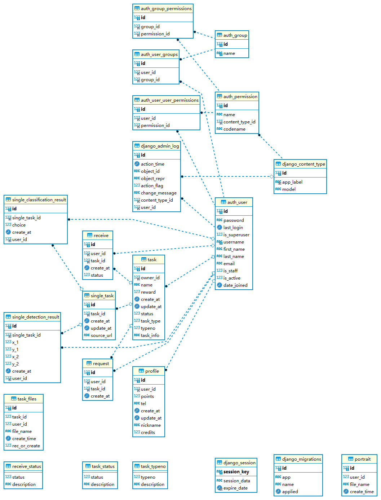

## auth_user

django自带User模块，存储用户信息

**主要属性**

| 类型 | 名称     | 备注                 |
| ---- | -------- | -------------------- |
| int  | id       |                      |
| str  | password | 加密密码             |
| str  | username | 用户名（不允许重复） |

## task

维护任务信息

**主要属性**

| 类型 | 名称      | 备注         |
| ---- | --------- | ------------ |
| int  | id        |              |
| int  | owner_id  | 发布者id     |
| str  | name      | 任务名       |
| int  | reward    | 奖励         |
| int  | status    | 任务状态     |
| int  | task_type | 任务类型     |
| str  | task_info | 任务简要描述 |
|      |           |              |

## request

向任务发布者提出的任务领取请求

**主要属性**

| 类型 | 名称    | 备注           |
| ---- | ------- | -------------- |
| int  | id      |                |
| int  | user_id | 提出请求用户id |
| int  | task_id | 任务id         |

## profile

用户信息

**主要属性**

| 类型 | 名称     | 备注                       |
| ---- | -------- | -------------------------- |
| int  | id       |                            |
| int  | user_id  |                            |
| int  | points   | 点数（完成任务后获得奖励） |
| str  | tel      | 电话                       |
| str  | nickname | 昵称                       |
| int  | credits  | 信誉                       |

## receive

完成任务的请求维护

**主要属性**

| 类型       | 名称      | 备注                        |
| ---------- | --------- | --------------------------- |
| int        | id        |                             |
| int        | user_id   |                             |
| int        | task_id   |                             |
| time_stamp | create_at |                             |
| int        | status    | 1:完成任务2：完成任务并结算 |
|            |           |                             |

## task_files

用户任务文件信息维护

**主要属性**

| 类型 | 名称          | 备注                                                 |
| ---- | ------------- | ---------------------------------------------------- |
| int  | id            |                                                      |
| int  | user_id       |                                                      |
| int  | task_id       |                                                      |
| str  | file_name     |                                                      |
| int  | rec_or_create | 0:是任务发布方 1：是任务作答放（保存在不同文件夹下） |

## portrait

头像

**主要属性**

| 类型 | 名称      | 备注 |
| ---- | --------- | ---- |
| int  | id        |      |
| int  | user_id   |      |
| str  | file_name |      |